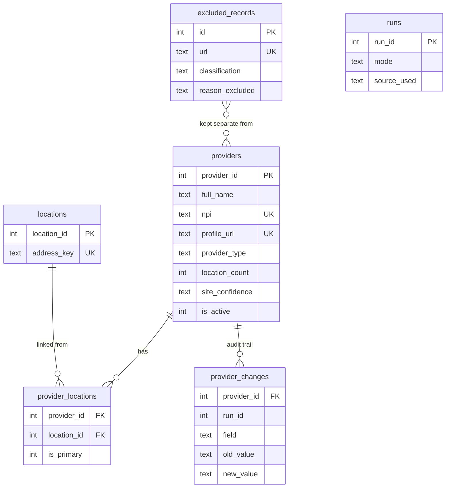

# ProviderMap

**A reusable, adapter-based pipeline for turning a healthcare system's public
provider directory into a queryable database of provider → primary site of
care.**

Built to answer one question — *given a provider's name, where do they
actually practice?* — for organizations whose billing data is centralized and
therefore doesn't reflect where care was actually delivered. AdventHealth
ships as the reference adapter; the pipeline itself has no AdventHealth-specific
code in it (see [Architecture](#architecture)).

[](https://github.com/glassface2002-jpg/providermap/actions/workflows/ci.yml)
[](LICENSE)
[](pyproject.toml)

---

## Features

- **Adapter framework** — site-specific knowledge (URL shapes, HTML
  structure, available endpoints) lives entirely behind a `SiteAdapter`
  interface. Supporting a second health system means writing an adapter, not
  touching the pipeline.
- **API-first discovery** — probes for a real sitemap, JSON:API, or AJAX
  endpoint before ever falling back to scraping rendered HTML.
- **Authoritative classification** — uses the free CMS NPPES registry to
  distinguish individual providers from facilities/organizations, rather than
  guessing from name patterns. Optional and degrades gracefully when
  disabled or unavailable.
- **Incremental updates** — content-hash change detection, a field-level
  audit trail, and soft deactivation (providers who leave a directory are
  marked inactive, never deleted — historical billing data still points at
  them).
- **Dry-run mode** — a genuine rehearsal: reads and dedupes exactly as a live
  run would, then rolls back every write.
- **Offline test mode** — a deterministic, adversarial 100-record fixture
  dataset exercises the entire pipeline with zero network access.
- **Typed throughout** — dataclass models instead of untyped dicts, a clean
  mypy pass, Black + Ruff enforced in CI.
- **Organizations** — a parallel `OrganizationAdapter` track auto-fetches
  CMS's public hospital dataset (no manual download) into a
  `provider → organization → location` model, enriches websites from
  Wikidata's verified data first (falling back to a labeled best-effort
  guess only where Wikidata has nothing), and links providers to
  organizations by exact name match (never fuzzy). See
  [ROADMAP.md](ROADMAP.md) for the completed staged plan.

---

## Installation

### Windows

```powershell
powershell -ExecutionPolicy Bypass -File setup.ps1
```

Finds Python, creates a virtual environment, installs dependencies, and runs
the offline self-test automatically. Then:

```
notepad config.yaml          REM replace REPLACE_WITH_YOUR_EMAIL
run.bat investigate
```

### macOS / Linux

```bash
python3 -m venv .venv && source .venv/bin/activate
pip install -e ".[dev]"
cp config.example.yaml config.yaml   # then edit politeness.user_agent
providermap test
```

### Docker

```bash
cp config.example.yaml config.yaml   # then edit politeness.user_agent
docker compose run --rm providermap test
docker compose run --rm providermap investigate
```

Python 3.10+. No database server required. Browser automation (Playwright)
is optional — only needed for `site.fetch_mode: "playwright"`, a site whose
bot-management blocks plain HTTP clients; see [Architecture](#architecture)
and `PROJECT_STATE.md`. Install it with:

```bash
pip install -e ".[render]"
playwright install chromium
```

---

## Quick start

Try it with zero setup risk — no network, no config file needed:

```bash
providermap test
```

Runs the full pipeline (discovery, NPPES lookup, classification, validation,
dedupe, incremental change tracking) against a built-in adversarial fixture
and reports pass/fail:

```
Pipeline is healthy.
```

Then, against a real site:

```bash
providermap investigate                        # 1. analyse the site
#   -> read logs/investigation_report.md
providermap trial                               # 2. live, 10 records, auto-exports
#   -> read exports/output/trial/providers.xlsx
providermap scrape --dry-run --limit 50         # 3. rehearsal, writes nothing
providermap scrape --limit 50                   # 4. small real trial
providermap export                              # 5. eyeball the output
providermap scrape                               # 6. the full run (resumable)
providermap export
```

**Before step 2**, confirm you're allowed to: `robots.txt` is enforced
automatically, but that's a technical floor, not permission. Thousands of
automated requests against a healthcare system's site is worth a short email
first — and if they have a provider data feed, this becomes an import script
instead of a scraper.

---

## Configuration

Every tunable lives in `config.yaml` (copied from `config.example.yaml`) —
nothing is hardcoded in source. `config.yaml` is gitignored so a personal
contact email is never accidentally committed.

```yaml
site:
  base_url: "https://www.adventhealth.com"
  force_source: null          # pin a discovery strategy once you know which works

politeness:
  requests_per_second: 0.5    # one request every 2s, by default
  max_concurrent: 2
  user_agent: "ProviderMapBot/1.0 (+contact: REPLACE_WITH_YOUR_EMAIL)"
  respect_robots_txt: true    # do not disable

nppes:
  enabled: true                          # false -> heuristics only, still runs
  trip_after_consecutive_failures: 20    # circuit breaker

# Only consulted when site.fetch_mode is "playwright" - see the `[render]`
# install step above and PROJECT_STATE.md for when this does (and, for
# AdventHealth specifically, currently does not) unlock a blocked site.
rendering:
  headless: true
  wait_after_load_seconds: 1.5

npi:
  checksum: "warn"       # strict | warn | off
  require_npi: true
  require_nppes: false

incremental:
  refresh_older_than_days: 30
  deactivate_missing: true
```

See `config.example.yaml` for the complete, commented reference. Alternatively,
set `PROVIDERMAP_CONTACT_EMAIL` in the environment (see `.env.example`)
instead of editing the file directly.

---

## Usage examples

```bash
providermap test                    # offline pipeline run + fixture dataset check
providermap investigate             # site analysis + data-quality sample
providermap trial --n 10            # live: discover + enrich N + auto-export, one command
providermap discover                # find every provider URL (no enrichment)
providermap scrape                  # process the queue (resumable — Ctrl-C is safe)
providermap scrape --limit 100      # process at most 100 URLs this run
providermap scrape --dry-run        # rehearsal — nothing written
providermap refresh                 # re-check records older than 30 days
providermap refresh --older-than 0  # force re-check of everything
providermap export                  # write the three .xlsx files
providermap status                  # progress + recent run history
providermap changes                 # what moved since the last run
providermap query "Menezes"         # provider -> primary site of care

# Organizations (see ROADMAP.md) - independent of the above, no --adapter needed
providermap ingest-organizations --dry-run   # rehearsal - nothing written
providermap ingest-organizations             # auto-fetches CMS's current dataset, no upload needed
providermap enrich-organizations --dry-run   # website discovery, rehearsal
providermap enrich-organizations             # Wikidata (verified) first, guess as fallback
providermap link-organizations --dry-run     # link providers to organizations, rehearsal
providermap link-organizations               # same, for real (exact name match only, never fuzzy)
```

Re-running is always safe: `scrape` skips anything already marked `done`,
responses are cached to `.cache/` for 30 days, and `refresh` is how you keep
the database current without a full re-crawl.

---

## Architecture

```
                    ┌─────────────────────┐
                    │        CLI           │   providermap/cli.py
                    └──────────┬───────────┘
                               │
                    ┌──────────▼───────────┐
                    │      Pipeline         │   providermap/pipeline.py
                    │  discover / enrich    │
                    └──────┬───────┬────────┘
                           │       │
              ┌────────────┘       └────────────┐
              ▼                                  ▼
   ┌─────────────────────┐           ┌─────────────────────┐
   │   SiteAdapter (ABC)   │◄─────────│   Sources             │
   │  adapters/base.py     │  used by │  sitemap/jsonapi/      │
   │                        │          │  views_ajax/html       │
   │  ┌──────────────────┐ │           │  providermap/sources.py│
   │  │ AdventHealthAdapter│ │          └─────────────────────┘
   │  │ adapters/providers/  │
   │  │   adventhealth        │
   │  └──────────────────┘ │
   └─────────────────────┘
              │
     ┌────────┴─────────┬──────────────┬───────────────┐
     ▼                   ▼              ▼               ▼
┌─────────┐      ┌───────────┐   ┌───────────┐   ┌─────────────┐
│  net.py  │      │ nppes.py  │   │validator.py│   │ database.py  │
│  HTTP,   │      │ CMS NPI   │   │classify +  │   │ SQLite,      │
│  robots, │      │ registry  │   │validate    │   │ dedupe,      │
│  cache   │      │ client    │   │            │   │ incremental  │
└─────────┘      └───────────┘   └───────────┘   └─────────────┘
                                                          │
                                                          ▼
                                                  ┌───────────────┐
                                                  │  exporter.py   │
                                                  │  .xlsx output  │
                                                  └───────────────┘
```

**The pipeline (`providermap/`) contains zero AdventHealth-specific code.**
Everything site-specific — URL patterns, which endpoints exist, HTML
structure, brand-name keyword lists — lives in `adapters/providers/adventhealth/`
behind the `SiteAdapter` interface. A second health system means writing a
second adapter; nothing under `providermap/` changes. See `adapters/base.py`
for the exact contract and `CONTRIBUTING.md` for a walkthrough of adding one.

### Why NPPES

Every AdventHealth profile URL ends in the provider's 10-digit NPI:

```
/doctors/centra-care-ocala-1710588744
/find-doctor/doctor/justin-menezes-md-1194013169
```

CMS enumerates NPIs as either **NPI-1** (an individual) or **NPI-2** (an
organization) — precisely the distinction needed to keep facility pages out
of the providers table. A credential-only heuristic gets this wrong for
something like `"Whitfield and Brennan MD PA"` (an organization with "MD"
right in the name); NPPES gets it right. NPPES is optional
(`nppes.enabled: false`) and the pipeline still produces a dataset without
it — just a less confident one (see `site_confidence` below).

### Database



Full schema and decision rationale in `providermap/database.py`'s module
docstring. Highlights:

- **Dedupe is a database constraint, not application logic.** `npi` and
  `profile_url` are both `UNIQUE`; a crash mid-run cannot produce duplicates.
- **`location_count`** is counted from structural signals on the profile page
  (distinct appointment-link IDs), not a guessed CSS selector.
- **`site_confidence`** (`high`/`medium`/`low`) reflects how much to trust
  `primary_site_of_care` — it drops with location count, with NPPES
  unavailability, and with a name mismatch against the CMS record. **Filter
  on `high` before joining to billing data**; treat the rest as a review
  queue.
- **Same-name, different-NPI collisions are reported, never auto-merged** —
  two real people can share a name (`summary.xlsx` → "Duplicate Review").
- **Migrations are automatic and idempotent** — opening an older-schema
  database adds new columns/tables in place; nothing is ever dropped.

---

## Export examples

`providermap export` writes three workbooks to `exports/output/`:

| File | Contents |
|---|---|
| `providers.xlsx` | One row per active provider (23 columns), rows below `high` confidence highlighted; a `Departed` tab for providers no longer in the directory |
| `excluded_records.xlsx` | Every non-provider record and why, plus a breakdown by classification |
| `summary.xlsx` | Run stats, provider-type breakdown, site-confidence breakdown, duplicate-review queue, recent field-level changes, full run history, and errors |

```bash
providermap query "Menezes"
```
```
  Justin Menezes, MD   (NPI 1194013169)
    Specialty:       Family Medicine
    Primary site:    AdventHealth Medical Group Family Medicine at Winter Park
    Address:         133 Benmore Drive Suite 200, Winter Park, FL 32792
    Locations:       1
    Confidence:      high
```

---

## Troubleshooting

**"STOP: set a real contact address in config.yaml"** — the pipeline refuses
to run against a live site with a placeholder `user_agent`; edit
`politeness.user_agent` or set `PROVIDERMAP_CONTACT_EMAIL`. `providermap test`
doesn't require this.

**`RuntimeError: No usable source found`** — every discovery strategy failed.
Run `providermap investigate` and read `logs/investigation_report.md`; the
site's structure likely changed since the adapter was written.

**Pagination warning in the logs** ("returned only URLs already seen") — the
`site.page_param` in `config.yaml` doesn't match what the site actually uses.
`providermap investigate` tests this explicitly.

**NPPES circuit breaker tripped** — the registry failed 20 times in a row and
the run switched to heuristic-only classification for the rest of the batch.
Re-run later (or just `refresh`) to fill in the affected records once NPPES
is back.

**A provider's `site_confidence` isn't `high`** — check `source_notes` on
that row; it names the specific reason (multiple locations, no NPPES record,
name mismatch).

---

## Legal & ethical use

- This project collects only **publicly available** provider directory
  information already published by the health system on its own website.
- **No patient data or protected health information (PHI) is collected** —
  this pipeline touches provider directory listings only, never patient
  records.
- **You are responsible** for complying with applicable law, the target
  website's Terms of Service, and its `robots.txt` (which this tool enforces
  automatically, but that is a technical floor, not a substitute for
  checking ToS or asking permission).
- Intended for **educational, research, and data-engineering purposes** —
  e.g., reconciling centralized billing records against actual sites of care,
  as described at the top of this README.

---

## Known limitations

1. **AdventHealth's rendered profile page (`/doctors/{slug}-{npi}`) is
   currently blocked by Akamai bot-management** for both plain HTTP and a
   vanilla, non-evasive Playwright browser (verified directly, not assumed —
   see `PROJECT_STATE.md`). `/sitemap.xml`, `/robots.txt`, and the
   `/physician/vcard/{npi}` endpoint are not blocked, so discovery and
   vCard-sourced name/practice/phone/address enrichment work today over
   plain HTTP. Anything sourced only from the rendered page — JSON-LD, the
   `<title>`/`og:title` HTML-scraping fallback, and the appointment-link
   location count that drives `location_count`/`site_confidence` — is
   unavailable for live data until that access situation changes; affected
   records are still stored, just with those fields at their defaults. See
   the README's "Legal & ethical use" section for the recommended next step
   if this matters enough to pursue further.
2. **The AdventHealth adapter's specialty extraction** (the HTML-scraping
   fallback, tried only when JSON-LD is absent) is inferred from
   `<title>`/`og:title` text, not confirmed against a live DOM inspection.
   It fails soft — falls back to the NPPES taxonomy description — but check
   this column after a trial run.
3. **Secondary practice locations are counted, not individually captured.**
   The adapter reliably counts how many locations a provider has (used for
   `site_confidence`) but only stores the primary address. The
   `provider_locations` table is wired for full multi-address capture — a
   natural next increment for a contributor.
4. **NPPES coverage isn't 100%** — deactivated or very recently issued NPIs
   won't resolve; those fall back to heuristics and are marked
   `nppes_enumeration = 'not_found'`.
5. Only one adapter (AdventHealth) currently ships. The framework is designed
   for more; see `CONTRIBUTING.md`.

---

## Project structure

```
providermap/
├── providermap/            # the pipeline - no site-specific code
│   ├── cli.py                CLI entrypoint
│   ├── config.py              typed configuration loader
│   ├── models.py               dataclasses: Provider, Location, ...
│   ├── net.py                   HTTP client, rate limiting, cache, robots.txt
│   ├── render.py                 optional Playwright-rendered fetch backend
│   ├── nppes.py                  CMS NPI registry client + circuit breaker
│   ├── sources.py                 sitemap/jsonapi/views_ajax/html discovery
│   ├── validator.py                classification + validation rules
│   ├── database.py                  SQLite schema, migrations, dedupe
│   ├── exporter.py                   Excel export
│   ├── discover.py                    site analysis / investigation
│   ├── parser_utils.py                 generic parsing (NPI checksum, vCard,
│   │                                     JSON-LD, ...)
│   ├── website_enrichment.py            best-effort org website discovery
│   │                                     (fallback, see wikidata_hospitals.py)
│   ├── wikidata_hospitals.py             bulk verified hospital website lookup
│   └── organization_linking.py           exact-match provider<->org linking
├── adapters/
│   ├── base.py               SiteAdapter interface (provider directories)
│   ├── providers/            provider adapters
│   │   └── adventhealth/       reference provider adapter
│   │       ├── adapter.py
│   │       └── fixtures.py     offline test dataset + fetcher
│   └── organizations/        organization adapters (see ROADMAP.md)
│       ├── base.py             OrganizationAdapter interface
│       └── cms_hospitals/      first concrete adapter (CMS hospital dataset)
├── tests/                   pytest suite, fully offline
├── database/  logs/  exports/output/    (gitignored - generated at runtime)
├── config.example.yaml
├── PROJECT_STATE.md         what's actually verified working against the live site, and why
├── ROADMAP.md               the provider -> organization -> location platform direction
├── pyproject.toml           Black / Ruff / mypy / pytest configuration
├── Dockerfile  docker-compose.yml
├── .github/workflows/ci.yml
├── setup.ps1  run.bat       Windows convenience scripts
└── run.py                   thin entrypoint (no install required)
```

---

## License

[MIT](LICENSE).

## Contributing

See [CONTRIBUTING.md](CONTRIBUTING.md) — development setup, test suite,
code style, and a walkthrough of adding a new site adapter. See
[CHANGELOG.md](CHANGELOG.md) for release history.
